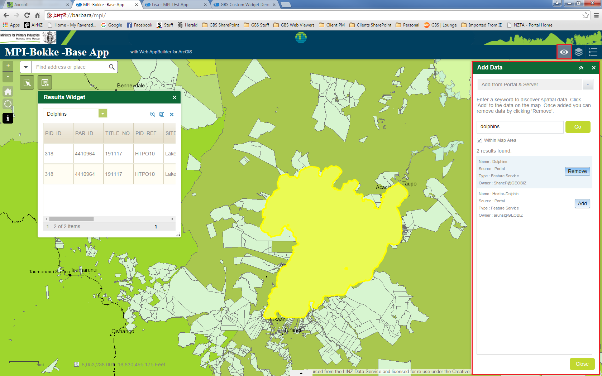
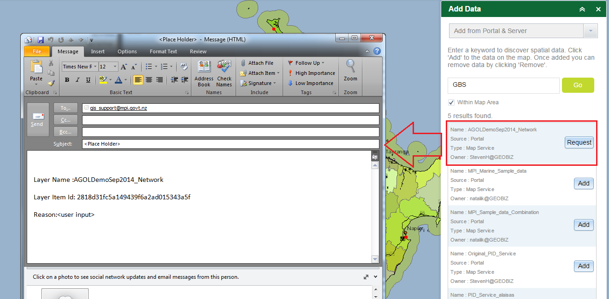
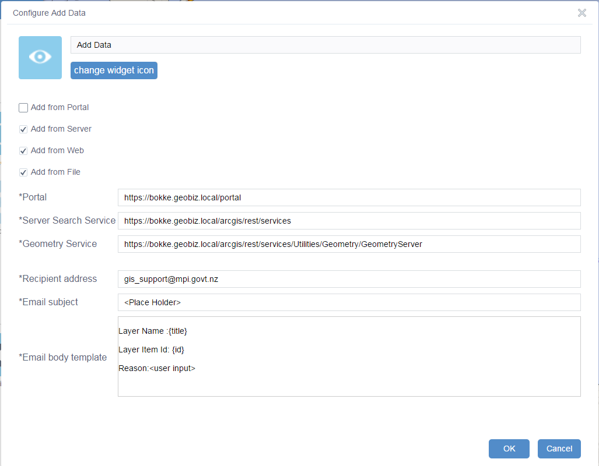

# Add Data widget #
*Topic Last Updated: 05/04/2016*

**Primary purpose:**  

- To allow users to search for layers in Portal, and add/remove them from their current map.  

## GBS WAB Widget Demo ##
Contact [GBS](http://gbs.kiwi/) for access to the Custom Tool Demo site.

## Widget Description ##
Add Data Widget

### IP Owner & Product Name ###
Ministry for Primary Industries (MPI) - Add Data Widget

Developed for MPI on WAB 1.1, using JavaScript API 3.13

### Customisation Description ###
This product is a BRAND NEW Web AppBuilder Widget, i.e. it does not extend any functionality that is currently available in any of the OOTB Widgets.

Custom functionality that has been developed for the Add Data Widget is as follows:
 
#### Search for Layers from Portal 
This function allows users to search for layers registered in Portal, add and/or remove them to/from their map.  Searching can be restricted spatially, to be limited to the current map extent.

Additionally, if the search returns a layer that the user does not have access to, because security.manager has restricted access to the end service, the function allows allow the user to request access to the layer. 

 
#### Search for Layers from Server
This function allows users to search for layers from Server, add and/or remove them to/from their map. As for searching layers from Portal, searching can be restricted spatially, to be limited to the current map extent.

Note: If the user does not have access to a Layer, because security.manager has restricted access to the end service, the function cannot advise the user to request access to the layer.
 

## Options configurable by Client Admin ##

<table>
	<tr>
		<th>ID</th>
		<th>Configurable Option</th>
	</tr>
	<tr>
		<td>1</td>
		<td>Portal Search Service Availability – On/Off</td>
	</tr>
	<tr>
		<td>2</td>
		<td>Portal Search Service URL, e.g. http://hostname/portal/sharing/rest/search</td>
	</tr>
	<tr>
		<td>3</td>
		<td>Server Search Service Availability – On/Off</td>
	</tr>
	<tr>
		<td>4</td>
		<td>Server REST Service URL, e.g. http://hostname/arcgis/rest</td>
	</tr>
	<tr>
		<td>5</td>
		<td>Email settings for Restricted layers, i.e. To address, Subject name, and Body content</td>
	</tr>
	<tr>
		<td>6</td>
		<td>Related Screenshot:
			
		</td>
	</tr>

</table>
 
## Dependencies / Pre-Requisite Tasks ##

**None**

 
## Reason for Customisation ##

MPI had the following requirements that could not be met using OOTB WAB

<table>
	<tr>
		<th>ID</th>
		<th>Details</th>
	</tr>
	<tr>
		<td>1</td>
		<td>Be able to search within the Geospatial data warehouse (Portal for ArcGIS and ArcGIS Server) and add any service that has been published.   Not persisting over sessions.</td>
	</tr>
	<tr>
		<td>2</td>
		<td>Data should be visible in legend and be removed by the 'reset map' tool, undo tool and erase tools.</td>
	</tr>
	<tr>
		<td>3</td>
		<td>Need to be able to find layers within the service - i.e. if the service is named 'freshwater fish' but has a layer named 'Blue Cod Annual Distribution' in it, if you search for Blue Cod the service should pop up as it contains a layer with Blue Cod in it.</td>
	</tr>
</table>
 
## Possible Future Development Options ##

<table>
	<tr>
		<th>ID</th>
		<th>Details</th>
	</tr>
</table>
 
## Glossary of Terms ##

<table>
	<tr>
		<th>Abbreviation</th>
		<th>Description (Reference)</th>
	</tr>
</table>

 
 

 
 

 
 

 
 

 
 

 
 

 
 
 
 
 
